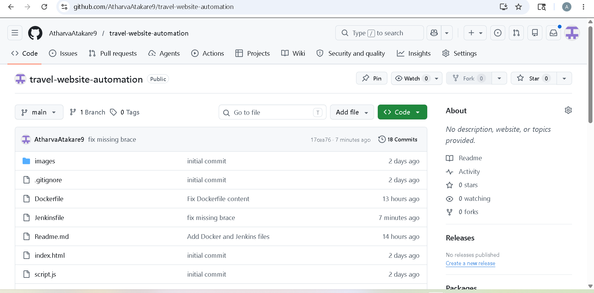
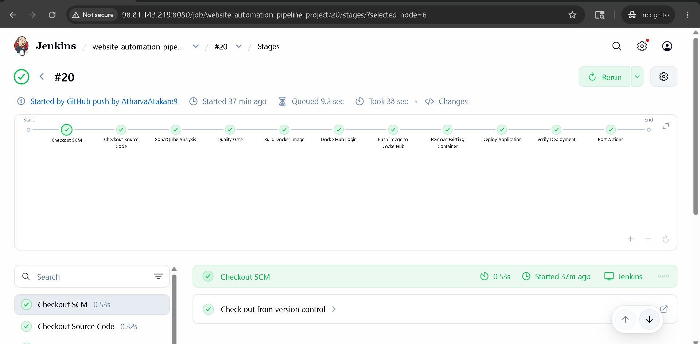
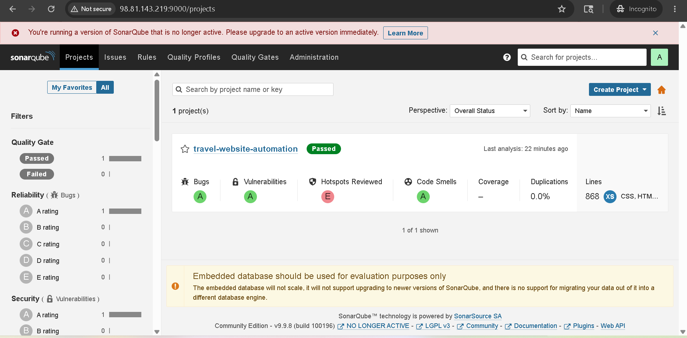
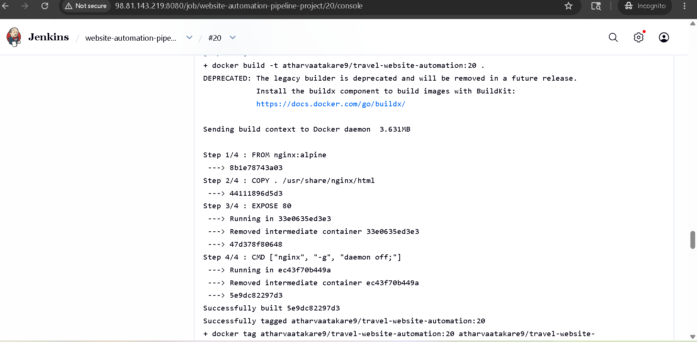
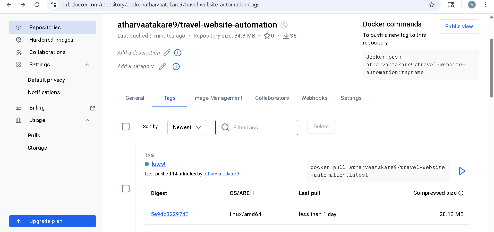
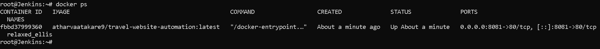
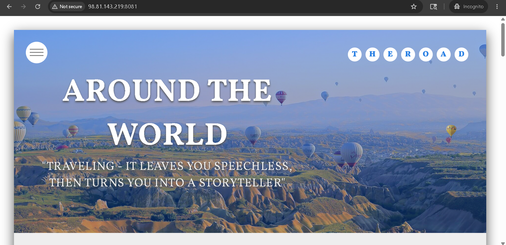

--

# 🚀 Travel Website CI/CD Pipeline (DevOps Project)

## 📌 Project Overview

This project demonstrates a complete **CI/CD pipeline** for a static travel website using modern DevOps tools. The pipeline automates code integration, quality analysis, containerization, image scanning, and deployment.

---

# 🏗️ Architecture Flow

```text
GitHub → Jenkins → SonarQube → Trivy Scan → Docker Build → DockerHub → Deploy → Health Check
```

---

# ⚙️ Tech Stack

* Git & GitHub
* Jenkins (CI/CD Automation)
* Docker
* DockerHub
* SonarQube (Code Quality Analysis)
* Linux (Ubuntu EC2)

---

# 🔄 CI/CD Pipeline Steps

## 1️⃣ GitHub (Source Code Management)

* Developer pushes code to GitHub repository
* Jenkins webhook automatically triggers pipeline

📸 Screenshot:

```



---


## 2️⃣ Jenkins (Automation Server)

* Jenkins pulls latest code from GitHub
* Executes defined pipeline stages

📸 Screenshot:

```


```

## 3️⃣ SonarQube Analysis

* Performs static code analysis
* Detects:

  * Bugs
  * Code smells
  * Security vulnerabilities

📌 Quality Gate ensures only clean code proceeds

📸 Screenshot:

```

```

---

## 4 Docker Image Build

* Application is containerized using Docker
* Image is tagged with build number

```bash
docker build -t travel-website:${BUILD_NUMBER} .
```

📸 Screenshot:

```

```

---

## 6️⃣ DockerHub Push

* Docker image pushed to DockerHub registry
* Versioning handled using build number + latest tag

📸 Screenshot:

```

```

---

## 7️⃣ Deployment Stage

* Container deployed on EC2 instance
* Application exposed on port `8081`

```bash
docker run -d -p 8081:80 travel-website
```

📸 Screenshot:

```

```

---

## 8️⃣ Health Check

* Verifies application is running
* Uses curl to test endpoint

```bash
curl http://localhost:8081
```

📸 Screenshot:

```

```

---

# 🔐 Jenkins Credentials Used

| Credential ID   | Purpose                  |
| --------------- | ------------------------ |
| dockerhub-creds | Docker Hub login         |
| sonar-token     | SonarQube authentication |

---

# 📊 Pipeline Features

✔ Fully Automated CI/CD
✔ Code Quality Check (SonarQube)
✔ Security Scanning (Trivy)
✔ Docker Containerization
✔ Auto Deployment
✔ Health Verification

---

# 🚀 How to Run Project

```bash
# 1. Clone repo
git clone https://github.com/your-repo.git

# 2. Open Jenkins
http://<EC2-IP>:8080

# 3. Run pipeline
Click "Build Now"
```

---

# 📸 Final Output

```
Application runs on:
http://<EC2-IP>:8081
```

---

# 🏆 Key Learning Outcomes

* CI/CD pipeline automation
* Jenkins pipeline scripting
* Docker container lifecycle
* DevSecOps basics (Trivy integration)
* Code quality enforcement (SonarQube)
* Real-world deployment workflow

---


